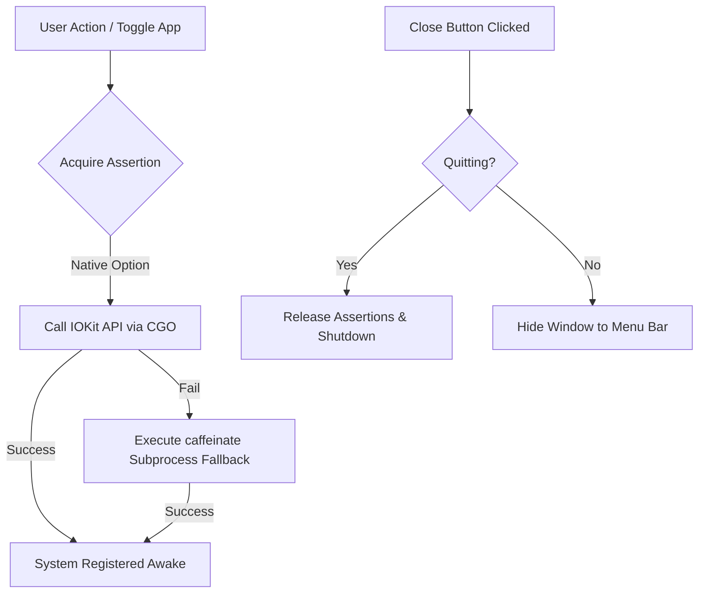

# Stay Awake ⚡

Keep your Mac awake while AI agents, long-running builds, scripts, large downloads, and development containers finish executing. `Stay Awake` is a lightweight, premium macOS menu bar utility that prevents system idle sleep.

---

## Key Features

- **⚡ Native Sleep Prevention**: Interfaces directly with macOS `IOKit` power management framework assertions (`IOPMAssertionCreateWithName`) to block idle sleep.
- **☕ Fail-Safe Subprocess Fallback**: If the native API fails or runs in restricted sandboxes, it gracefully falls back to launching a background `caffeinate` process.
- **🔌 Seamless Menu Bar Status**: A status item in the macOS menu bar dynamically updates (`💤 Stay Awake` vs `⚡ Stay Awake`) and offers control options (Toggle state, Open App, and Quit).
- **🖥️ Glassmorphism User Interface**: A frosted glass dark theme with modern Outfit typography and subtle neon status glow animations.
- **📁 Startup Settings**: Features to launch automatically on login (custom macOS Launch Agent plist) and to start minimized directly to the menu bar.
- **💾 Auto-Persistence**: Automatically saves and loads your configurations (`launchAtLogin`, `startMinimized`, `awakeState`) in standard user directory config files.

---

## How It Works



1. **Native Sleep Assertions**: The app uses `CGO` to call Apple's `IOPMAssertionCreateWithName` with assertion type `kIOPMAssertionTypeNoIdleSleep` and level `kIOPMAssertionLevelOn`. This blocks the CPU and system components from entering sleep while letting the display sleep if standard OS display settings demand it.
2. **Caffeinate Fallback**: If the API call fails or is executed on unsupported builds, the app spawns a background command `caffeinate -i -d` and tracks its process ID, killing it cleanly on toggle or app exit.
3. **Window Intercept**: When the close button is clicked, a custom `OnBeforeClose` event intercepts the close. If the app is not quitting (i.e. if it wasn't triggered from the "Quit" menu option), the window is hidden, and execution continues silently in the background.
4. **Launch at Login**: Toggling "Launch at Login" writes a Launch Agent plist XML file to `~/Library/LaunchAgents/com.stayawake.app.plist` referencing the executable path. Toggling it off removes the file.

---

## Technical Stack

- **Go (Golang)**: Core backend logic, macOS native bindings, subprocess tracking, Launch Agent plist assembly, and local JSON config management.
- **Objective-C (CGO)**: Integration with Apple's `NSStatusItem`, `NSMenu`, and `IOKit` power assertions.
- **Wails v2**: Framework for native desktop windowing and lightning-fast Go-to-JavaScript communication bindings.
- **Vite & Vanilla JavaScript / CSS**: Ultra-lightweight, zero-framework, glassmorphism frontend representation.

---

## Development Setup

### Prerequisites

To build and compile Stay Awake locally, you will need:
1. **macOS** (for compiling native apple frameworks)
2. **Go** (version 1.20 or later)
3. **Node.js** (version 18 or later) & **npm**
4. **Wails CLI** (Install via: `go install github.com/wailsapp/wails/v2/cmd/wails@latest`)

### Running in Development Mode

Run the following command in the root folder of the project to launch live-development with hot-reloading:

```bash
wails dev
```

This starts the Go backend, mounts the Vite server, and shows the live window. Any changes to frontend files (CSS, HTML, JS) or Go code will automatically re-render or compile the app.

### Building the Production App Bundle

To package a standalone `.app` bundle, run:

```bash
wails build -platform darwin
```

The compiled application bundle will be created in the `build/bin/` folder (e.g. `build/bin/Stay Awake.app`).

---

## Installation

1. Clone this repository or download the source.
2. Run `wails build -platform darwin`.
3. Open `build/bin/`.
4. Drag `Stay Awake.app` into your `/Applications` directory.

---

## License

This project is licensed under the MIT License - see the [LICENSE](LICENSE) file for details.
